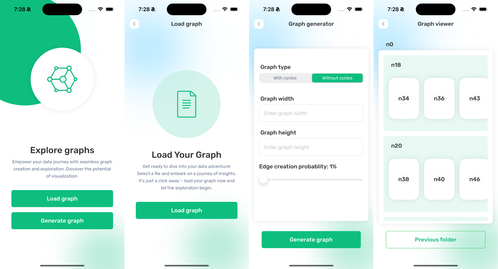

## Fractalian Graph Navigator

The Fractalian Graph Navigator is a iOS application designed for graphical exploration of large input graphs provided in GraphML format. This application offers an interactive and fractal-like experience, where each graph node is visually represented as a rectangle in the app's UI. Users can seamlessly navigate through the graph structure by clicking on these rectangles, revealing further rectangles that represent the directly reachable nodes from the parent node.

The application, developed using Swift and SwiftUI, is compatible with both macOS and iOS/iPadOS platforms, ensuring a consistent and user-friendly experience across devices. It handles input graphs with tens of thousands of nodes, including those with cycles, and provides user interface for an engaging exploration of complex graph relationships. The loading of the graph from a file is optimized using InputStream to avoid loading the entire XML file into memory.

Additionally, the application includes a convenient functionality for generating interesting graphs, allowing users to explore diverse graph structures, both with and without cycles. To enhance performance, the application employs efficient data presentation techniques, utilizing pagination mechanisms for smooth and responsive visualization of graph data.

## Build and Runtime Requirements
+ Xcode 15.1
+ iOS 16.0+

## Installation

### Setup Cocoapods repository

1. Run `pod install` to correctly setup the Cocoapods dependencies
2. Make sure that you open the project referring to  `*.xcworkspace` in Xcode or AppCode

## Screenshots

## Built With

* Swift
* SwiftUI
* XcodeGen
* SwiftLint